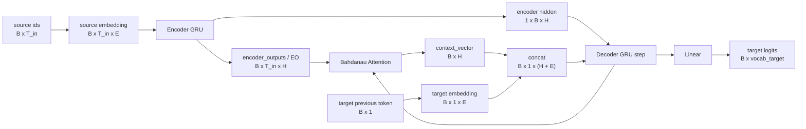

# Seq2Seq Attention 的 PyTorch 版笔记

本目录中的 `seq2seq_attention_pytorch.py` 是 `seq2seq_attention_tf2.2.ipynb` 的 PyTorch 改写版。原 notebook 用 TensorFlow/Keras 实现「西班牙语 -> 英语」翻译；这里默认也保持这个方向，若想改成「英语 -> 西班牙语」，运行时加 `--english-to-spanish`。

## 运行方式

在容器中运行：

```bash
docker compose exec dl-lab python seq2seq_attention_pytorch.py --shape-demo
docker compose exec dl-lab python seq2seq_attention_pytorch.py --num-examples 512 --epochs 1 --batch-size 32 --hidden-size 128 --embedding-dim 64
```

更接近原 notebook 的训练配置：

```bash
docker compose exec dl-lab python seq2seq_attention_pytorch.py --num-examples 30000 --epochs 10
```

训练结束会保存：

- `seq2seq_attention_pytorch.pt`：模型权重和词表。
- `attention.png`：一次翻译的 attention 权重热力图。

## 数据流

数据来自 `data_spa_en/spa.txt`，每行形如：

```text
Go.    Ve.
```

脚本会做这些预处理：

1. 小写化。
2. 去除西班牙语重音，如 `frío -> frio`。
3. 在标点前后补空格。
4. 加上 `<start>` 和 `<end>`。
5. 建立词表，把 token 转成整数 id。
6. 用 padding 把同一个 batch 中的句子补到一样长。

因此一个 batch 的输入形状是：

```text
source: (B, T_in)
target: (B, T_out)
```

其中：

- `B` 是 batch size。
- `T_in` 是这个 batch 中输入句子的最大长度。
- `T_out` 是这个 batch 中目标句子的最大长度。
- 每个位置存的是一个词 id，不是 one-hot 向量。

## 模型结构



## Attention 的形状推导

Bahdanau attention 在每个 decoder 时间步都会重新算一次。

已知：

```text
encoder_outputs / EO: (B, T_in, H)
decoder hidden / query: (1, B, H)
```

先把 decoder hidden 调整成带时间轴的 query：

```text
query.permute(1, 0, 2): (B, 1, H)
```

然后打分：

```text
W1(EO):    (B, T_in, H)
W2(query): (B, 1, H)
```

这里的 `+` 使用 broadcasting，`(B, 1, H)` 会沿 `T_in` 复制，得到：

```text
tanh(W1(EO) + W2(query)): (B, T_in, H)
V(...):                    (B, T_in, 1)
```

最后一个 `Linear(H, 1)` 也就是原资料里的 `V` 或最后一层 `FC`，它把每个输入位置的隐藏向量压成一个 score。对输入序列维度做 softmax：

```text
attention_weights = softmax(score, dim=1): (B, T_in, 1)
```

`attention_weights[b, :, 0]` 是第 `b` 个样本对所有输入词的注意力分布，所有非 padding 位置加起来约等于 1。

## 为什么加权求和后还是向量

`draft.md` 中“对多个向量做加权求和，结果仍是向量”的解释是准确的。容易混淆的点在于：如果加权对象是标量，结果是标量；如果加权对象是向量，结果就是同维度向量。

在代码中：

```python
context = torch.sum(attention_weights * encoder_outputs, dim=1)
```

形状变化是：

```text
attention_weights: (B, T_in, 1)
encoder_outputs:   (B, T_in, H)
相乘后:             (B, T_in, H)
沿 T_in 求和后:      (B, H)
```

也就是说，attention 权重只决定“每个输入位置占多少比例”，真正被混合的是每个位置的 encoder output 向量。`context_vector` 是一个长度为 `H` 的信息摘要，不是单个数字。

## 对 pic1 / pic2 的核实

`pic1.png` 展示的是基于 attention 的 seq2seq 思路：encoder 产生每个输入位置的 `encoder_outputs`，decoder 在每一步用当前隐藏状态和所有 encoder outputs 计算一个 `context_vector`，再与当前 decoder 输入一起生成目标词。这个总体结构是正确的。

`pic2.png` 中的记号也基本正确：

- `EO`：encoder 每个位置的输出，形状是 `(B, T_in, H)`。
- `H`：decoder 某一步的隐藏状态，在 PyTorch GRU 中常见形状是 `(1, B, H)`。
- `FC`：全连接层，PyTorch 中对应 `nn.Linear`。
- `X`：decoder 当前步输入，训练时通常是目标句子的上一个真实 token，推理时是上一步预测 token。

需要补充的细节：

1. `score = FC(tanh(FC(EO) + FC(H)))` 描述的是 Bahdanau/additive attention。这里 `FC(H)` 要先变成 `(B, 1, H)`，再通过 broadcasting 加到每个输入位置上。
2. 最后一层 `FC` 输出的是每个输入位置的一个 score，所以 score 形状是 `(B, T_in, 1)`，不是 `(B, T_in, H)`。
3. `attention_weights = softmax(score, axis=1)` 中 `axis=1` 是输入序列长度维度，也就是在所有源句 token 之间归一化。
4. `context = sum(attention_weights * EO, axis=1)` 是沿输入序列长度求和，输出形状是 `(B, H)`。
5. 实际训练时应 mask 掉 padding 位置。脚本里在 softmax 前把 padding score 设为 `-inf`，避免模型把注意力分给 `<pad>`。

## Teacher Forcing

训练 decoder 时，第 0 步输入 `<start>`，目标是预测第 1 个 token；下一步通常直接喂入目标句子的真实 token，这叫 teacher forcing。

```text
target: <start> i am here <end>

step 1 input: <start>  -> predict: i
step 2 input: i        -> predict: am
step 3 input: am       -> predict: here
step 4 input: here     -> predict: <end>
```

推理时没有真实答案可用，所以 decoder 的下一步输入来自上一步自己的预测。

## TensorFlow 与 PyTorch 的主要对应

| TensorFlow/Keras | PyTorch |
| --- | --- |
| `keras.layers.Embedding` | `nn.Embedding` |
| `keras.layers.GRU(return_sequences=True, return_state=True)` | `nn.GRU(batch_first=True)` |
| `tf.expand_dims(x, 1)` | `x.unsqueeze(1)` |
| `tf.concat([...], axis=-1)` | `torch.cat([...], dim=-1)` |
| `tf.nn.softmax(score, axis=1)` | `F.softmax(score, dim=1)` |
| `SparseCategoricalCrossentropy(from_logits=True)` | `F.cross_entropy(..., ignore_index=0)` |

## 与原 notebook 的差异

- 原 notebook 使用 `tf.keras.preprocessing.text.Tokenizer`；这里用一个很小的 `Vocabulary` 类完成同样的词表功能。
- 原 notebook 对 padding 的 loss 做 mask；这里用 `ignore_index=0` 忽略 `<pad>`。
- 这里额外在 attention softmax 前 mask source padding，更严谨。
- 原 notebook 固定 batch size 并手写 hidden 初始化；PyTorch 的 GRU 会在未传 hidden 时自动使用零初始状态。

## 本次训练记录

训练时间：2026-06-09 01:25 左右，容器内使用 CUDA。

执行命令：

```bash
docker compose exec dl-lab python seq2seq_attention_pytorch.py --num-examples 30000 --epochs 10 --batch-size 64 --embedding-dim 256 --hidden-size 1024 --print-every 100 --checkpoint seq2seq_attention_pytorch.pt --attention-plot attention.png --eval-output seq2seq_attention_eval.md --eval-examples 20
```

训练配置：

- 方向：Spanish -> English
- 训练/验证样例数：24000 / 6000
- source vocab：8438
- target vocab：4549
- max source length：16
- max target length：11
- batch size：64
- embedding dim：256
- hidden size：1024
- teacher forcing ratio：1.0

产物：

- `seq2seq_attention_pytorch.pt`：训练后的 checkpoint，约 81 MB。
- `attention.png`：对 `hace mucho frio aqui.` 的 attention 热力图。
- `seq2seq_attention_eval.md`：本次评估报告。

Loss 记录如下。这里的验证 loss 使用 `teacher_forcing_ratio=0.0` 计算，更接近推理时“上一步预测喂给下一步”的自回归条件，因此会比 teacher-forced validation loss 更严格。

| Epoch | Train Loss | Val Loss |
| --- | ---: | ---: |
| 1 | 2.5672 | 3.3508 |
| 2 | 1.1438 | 2.8969 |
| 3 | 0.5454 | 2.8470 |
| 4 | 0.2825 | 2.8568 |
| 5 | 0.1808 | 2.9333 |
| 6 | 0.1377 | 3.0318 |
| 7 | 0.1206 | 3.2111 |
| 8 | 0.1156 | 3.1156 |
| 9 | 0.1119 | 3.3226 |
| 10 | 0.1145 | 3.3696 |

从曲线看，train loss 下降很快；val loss 在第 3 到第 4 轮附近最低，后面逐渐上升，说明原 notebook 规模的 10 epoch 配置在这个划分上已有过拟合迹象。后续如果追求泛化，可以保存 best-val checkpoint、减少 epoch，或加入 dropout / weight decay。

训练结束后的单句推理：

```text
input: hace mucho frio aqui.
predicted: it s very cold here .
```

20 个验证集样例的推理评估：

- Exact match：0.2000
- Token F1：0.7337

部分样例：

| Source | Reference | Prediction | Token F1 |
| --- | --- | --- | ---: |
| ella cocina muy bien . | she cooks very well . | she cooks very well . | 1.0000 |
| ¿ era cierta su historia ? | was her story true ? | was his story true ? | 0.8000 |
| la noche estaba fresca . | the night was cool . | the night was cold . | 0.8000 |
| necesito encontrar mi lapicera . | i need to find my pen . | i need to find my pen . | 1.0000 |
| mira con atencion . | watch closely . | look at us . | 0.2857 |
